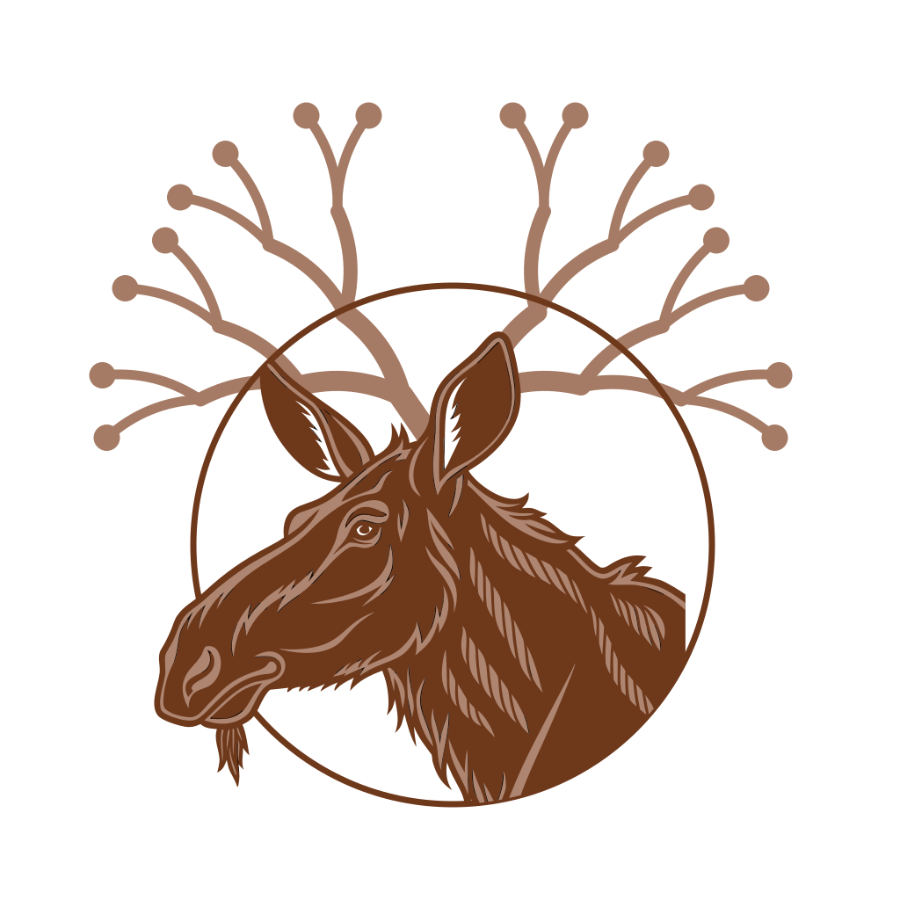
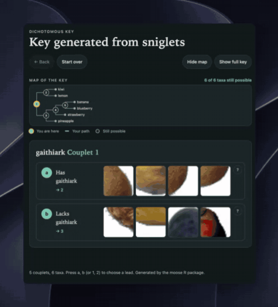

# dimoose 

An R package to manage dichotomous keys.

## Dichotomous keys

Dichotomous keys are bifurcating trees that are often used in species identification. More precisely, dichotomous keys are binary categorical decision trees with unique leaves. They have been a staple of taxonomic identification for centuries — Lamarck's *Flore française* (1778) is often credited with popularizing the form — and remain in everyday use in field guides and laboratory manuals today.

### Relationship to phylogenetic trees

Despite their different uses, phylogenetic trees are similar to dichotomous keys:
- the paths are traversed using mutation "decisions" instead of visible phenotypes
- all points on a phylogenetic tree represent an organism that actually existed (instead of a group of possibilities)

dimoose supports phylogenetic trees in which the mutations are known, such as PhyloTree, and ships PhyloTree Build 17 (the human mitochondrial DNA phylogeny, as distributed by Haplogrep 3).

## Package methods

This package provides tools to:
- convert from and to popular formats including consensus matrices, `ape` phylo, `data.tree`, data frames, JSON, YAML, and Newick
- merge and prune dichotomous keys
- generate interactive dichotomous keys ("wizards") as self-contained, mobile-friendly HTML
- **generate keys automatically** from a pile of labelled photos with a vision model (CLIP, or any model that produces embeddings) or from a multiple sequence alignment with a phylogeny program, and **follow those keys by machine**
- produce training data for machine learning using splits
- interoperate with the phylogenetics ecosystem (`ggtree`/`treeio`, `igraph`, Nextstrain/Auspice, Haplogrep)
- metadata slots for provenance and supporting guide images
- perform basic lexical analysis, and specialized data types (single nucleotide variations) of criteria and taxa
- build mixed effects conditional inference trees (mecits)

# Getting started

## Installation

Install dimoose from [R-universe](https://leipzig.r-universe.dev/dimoose),
which has ready-built versions for Windows, macOS and Linux:

```r
install.packages("dimoose", repos = c("https://leipzig.r-universe.dev", "https://cloud.r-project.org"))
```

The package was called moose until version 0.1.0; it was renamed because CRAN
has an unrelated package of that name.

Or install the current source from GitHub:

```r
install.packages("remotes")
remotes::install_github("leipzig/dimoose")
```

That is enough to read, build, check and export keys. Some features use
optional packages, which are only needed if you use that feature:

| Feature | Also needs |
|---|---|
| Keys from a sequence alignment (`keyFromAlignment()`) | `ape`, and `phangorn` for midpoint rooting, UPGMA, parsimony, maximum likelihood and proteins |
| Keys from photos (`visionModel()`, `embedImages()`) | `reticulate` (1.41 or later), which sets up Python and its packages on first use |
| Mixed-effects conditional inference trees (`mecit()`) | `partykit` and `lme4`, and `glmertree` for `method = "mob"` |
| Phylogenetics exports (`toTreedata()`, `toIgraph()`, `toAuspiceJSON()`) | `tidytree`, `tibble` and `ape`; `igraph`; `jsonlite` |

To install all of the optional R packages at once, and build the vignettes:

```r
remotes::install_github("leipzig/dimoose", dependencies = TRUE, build_vignettes = TRUE)
```

## A first key

```r
library(dimoose)
sharks <- sharkKey()
summary(sharks)
exportWizard(sharks, "sharks.html")   # an interactive, self-contained wizard
```

There are vignettes on automated key generation [from photos](vignettes/vision-keys.Rmd) and [from a sequence alignment](vignettes/alignment-keys.Rmd), and on [mixed-effects conditional inference trees](vignettes/mecit.Rmd).

## Included datasets

Four example keys ship with the package. They come from very different sources and are built in different ways, but they are all ordinary dimoose objects: they share the same fields (`leads`, `df`, `meta`, `taxa`, `desc`) and methods (`print()`, `summary()`, `validate()`, `toDataTree()`, `toNewick()`) and all work with `exportWizard()` and the phylogenetics exports.

### Sharks — `sharkKey()`

FishBase key 1, the *Key to the families of sharks in the Western Central Pacific* (Compagno 1998), parsed from saved FishBase pages in `inst/extdata/fishbase/`. A classic, human-authored morphological key: **23 couplets, 24 families**. It carries guide-image links, so the exported wizard shows a figure at each lead. This is the key the `importFishbase()` / `parseFishbase()` machinery produces from a live or saved FishBase page.

### Arachnids — `arachnidaKey()` (dataset `arachnida`)

The *Key to the Orders of Arachnida* from Triplehorn & Johnson (2005), *Borror and DeLong's Introduction to the Study of Insects*, 7th ed., transcribed by hand (see `data-raw/arachnida/`). **11 couplets, 11 orders** (Schizomida is reached from two couplets, so it is a small DAG rather than a strict tree). The `arachnida` dataset is the underlying table of leads; `keyFromLeads()` turns it into the key.

### Vibrio — `vibrioKey()` (dataset `vibrio`)

A key **generated** from a biochemical consensus matrix rather than written by a person. The `vibrio` dataset is the identification matrix of Noguerola & Blanch (2008), **74 taxa × 45 tests** (`+`/`-`/`(+)`/`(-)`/`v`/`ND`). `vibrioKey()` scores the tests, fits an `rpart` classification tree, and converts it with `keyFromRpart()` into a **73-couplet** key reaching all 74 species. Species the tests cannot separate share a result. This is the template for turning any feature matrix into a dichotomous key.

### PhyloTree — `phylotreeKey()` (datasets `phylotree17`, `phylotree17_mutations`)

PhyloTree Build 17, the human mitochondrial DNA phylogeny (van Oven 2015), as distributed by Haplogrep 3: **5,435 haplogroups** and **13,384 mutations**. `phylotree17` is one row per haplogroup (name, parent, depth, subclade count, mutations); `phylotree17_mutations` is one row per mutation (position, type, ancestral/derived base). `phylotreeKey()` turns the tree, or any subtree, into a key whose "characters" are the defining mutations — for example `phylotreeKey("H2a")`. The full tree is large (2,420 steps), so a subtree or a `maxDepth` is usually more practical for the wizard. This is the "phylogenetic tree as a key" case, where the decisions are mutations rather than visible phenotypes.

# Automated key generation

Most keys are written by people. dimoose can also generate one from data: from
a multiple sequence alignment, or from a pile of photos. Either way the result
is an ordinary dimoose key that works with `exportWizard()`, `classify()` and
the phylogenetics exports.

## From a multiple sequence alignment

One command takes aligned sequences to a key. A phylogeny program builds the
tree, dimoose roots it, and every fork becomes a couplet whose leads are the
alignment sites that tell its two sides apart:

```r
library(dimoose)
fasta <- system.file("extdata", "aligned.fasta", package = "dimoose")   # or the path of your own FASTA file
key <- keyFromAlignment(fasta)
exportWizard(key, "key.html")

head(key$leads[, c("Statement", "Character", "Next", "Taxon")], 4)
#>   Statement      Character Next   Taxon
#> 1         1       106G 35G    2
#> 2         1       106A 35A    3
#> 3         2 201T 234C 297G    -   No305
#> 4         2 201C 234T 297A    - No1114S
```

`aligned.fasta` is an example that ships with dimoose: 15 wood mouse cytochrome
*b* sequences. A second one, `mtdna.fasta`, has whole human mitochondrial
genomes for 14 haplogroups. Numbered by the sequence of the rCRS's haplogroup
and rooted on L0, its key asks about the familiar PhyloTree positions:

```r
mtdna <- system.file("extdata", "mtdna.fasta", package = "dimoose")
mt <- keyFromAlignment(mtdna, reference = "H2a2a1", outgroup = "L0a1")
mt$leads[7:8, c("Statement", "Character", "Next")]
#>   Statement         Character Next
#> 7         4 8701A 9540T 10873T    5
#> 8         4 8701G 9540C 10873C   12
```

Options:

- **The phylogeny program** is chosen with `tool`: `"nj"` (the default) and `"bionj"` use
  `ape`; `"upgma"`, `"parsimony"` and `"ml"` use `phangorn`; `"fasttree"` and
  `"iqtree"` run the FastTree or IQ-TREE program if it is installed.
- **A tree from any other program** goes in as `tree = "my.nwk"` (a Newick file).
- **The root** is the `outgroup` you name, or the midpoint.
- **Site numbers** are alignment columns, or positions in a `reference` sequence.
- **New sequences** are placed with `classify(key, alignmentScores(key, new))`.

See the [alignment vignette](vignettes/alignment-keys.Rmd).

## From a pile of photos

<a href="media/sniglets.mp4"></a>

*A key built from the example photos, followed in the wizard that
`exportWizard()` writes. Each choice asks about one sniglet and shows
crops of it. ([Full-quality video](media/sniglets.mp4))*

You need photos, and a label for each one saying what it shows. The photos
are embedded with a vision model (CLIP ViT-B/32 by default) that runs in
Python, but there is nothing to install by hand: the first `visionModel()`
call sets up a private Python with the packages it needs (through
`reticulate`, 1.41 or later) and reuses it afterwards. That first call
downloads several gigabytes, mostly PyTorch.

Then it is five steps. They run as written on the example photos that ship
with dimoose: 36 small photos of six fruits, from the
[Fruits-360](https://github.com/fruits-360/fruits-360-100x100) dataset
(CC BY-SA 4.0). For your own photos, give the path of your folder instead.

```r
library(dimoose)

# 1. Photos and labels. With one folder per class (pics/banana/..., pics/kiwi/...),
#    each photo is labelled by its folder.
pics   <- system.file("extdata", "pics", package = "dimoose")
images <- imageSet(pics)
#    Class in the file name:  imageSet("my_photos", label = function(x) sub("_.*$", "", x))
#    Labels in a table:       imageSet(tab$file, label = tab$species)

# 2. A vision model
model  <- visionModel()                          # regular CLIP; for organisms, visionModel(name = "bioclip")

# 3. Photos -> embeddings: one for each photo, and one for each of 4 x 4
#    overlapping tiles of it, so that features are local parts of the photo
emb    <- embedImages(model, images)

# 4. Generate sniglets (kinds of region that recur across photos, each given a
#    coined name) and grow a key on them
sniglets <- discoverSniglets(emb$patches, k = 40)
scores   <- snigletScores(emb$patches, sniglets$centroids)
key      <- keyFromSniglets(scores, images, sniglets, method = "rpart")

# 5. Add example crops and export an interactive page
key    <- patchExemplars(model, key, images)
exportWizard(key, "key.html")

# Identify a new photo with the key
new <- list.files(system.file("extdata", "new-photos", package = "dimoose"), full.names = TRUE)
classify(key, scoreImages(key, model, new))
```

With one photo per class, use the default `method = "balanced"` in step 4
(the [fordera](https://github.com/leipzig/fordera) method).

### Sniglets, and renaming them

The features in step 4 are found by the model, by clustering the tiles of
all the photos: each one is a kind of region that several photos have in
common, such as a rough skin or a stem end. They have no names, so dimoose
coins a pronounceable word for each one (`gaithiark`, `glienglaund`) and
calls these **sniglets**. Both leads of a couplet describe something: one
reads "Has glienglaund" and the other, where it can, says what those photos
have instead ("Lacks glienglaund; has laussym"). The wizard shows example
tiles on both leads, taken from every class that follows that lead. Once you
have looked at them, give the sniglets real names:

```r
snigletNames(key)                 # coined word, current name, definition, used by the key?

key <- renameSniglets(key, c(gaithiark = "a dull, finely textured skin"),
                      definitions = c(gaithiark = "Matt skin with a fine grain, as on a kiwi or a lemon"))

# or name them in a spreadsheet
write.csv(snigletNames(key), "names.csv", row.names = FALSE)   # fill in name and definition
key <- renameSniglets(key, "names.csv")
exportWizard(key, "key.html")     # leads now read "Has a dull, finely textured skin"
```

The coined word stays as the sniglet's permanent identifier: scores, machine
tests and saved name tables keep working after a rename, and a blank name
puts the coined word back. Only the names of sniglets the key uses matter.

### Questions from a vocabulary

To ask questions in plain words from the start, give a vocabulary of
contrasting features instead:

```r
vocab  <- data.frame(feature  = c("a smooth skin", "a round shape", "a yellow colour", "green leaves on top"),
                     opposite = c("a rough skin", "a long shape", "a dark colour", "no leaves"))
txt    <- embedTexts(model, vocabularyPrompts(vocab, "a photo of a fruit with {x}"))
qkey   <- keyFromClusters(emb$image, images, vocab, txt, template = "a photo of a fruit with {x}")
```

The [photo vignette](vignettes/vision-keys.Rmd) explains each step, and how
to measure a key's accuracy.

### Choosing a model: CLIP or BioCLIP

The model is chosen in step 2, by the `name` you give `visionModel()`:

| Your photos | Model | Call | First download |
|---|---|---|---|
| Anything: objects, products, vehicles, mixed subjects | CLIP ViT-B/32 (OpenAI), the default | `visionModel()` | about 350 MB |
| Organisms: plants, animals, fungi, specimens | [BioCLIP](https://imageomics.github.io/bioclip/) | `visionModel(name = "bioclip")` | about 600 MB |
| Organisms, when accuracy matters more than speed | [BioCLIP 2](https://huggingface.co/imageomics/bioclip-2) | `visionModel(name = "bioclip-2")` | about 1.7 GB |

For example, to build the key above with BioCLIP, replace step 2 with:

```r
model <- visionModel(name = "bioclip")
```

- **Only that one line changes.** `embedImages()`, `discoverSniglets()`,
  `keyFromSniglets()`, `patchExemplars()` and `exportWizard()` are called the
  same way with every model.
- **Build and follow a key with the same model.** The key records which
  model made it, and `scoreImages()` warns, or stops, if you give it a
  different one.
- **With BioCLIP, use sniglets.** Its text side was trained on names of
  organisms, not on descriptions of what they look like, so vocabulary
  questions (`keyFromClusters()`) work better with regular CLIP.
- **BioCLIP 2 is a larger model**, so embedding takes several times longer.

Other models: `name = "hf-hub:<organisation>/<model>"` loads any open_clip
model on the Hugging Face Hub whose image side is a vision transformer, and
`name = "local-dir:<folder>"` loads a copy you have downloaded.

No Python at all: the R side works on plain matrices, so if you already have
embeddings from some other encoder, pass them straight to
`discoverSniglets()`, `keyFromSniglets()`, `keyFromClusters()` and
`featureScores()`.

# Mixed-effects conditional inference trees

A mixed-effects conditional inference tree (MECIT) is a decision tree for
clustered data. A random effect absorbs the differences between clusters, so
the tree only splits on variables that matter within them. In mtDNA, this means
a recurrent mutation can be found even though each large haplogroup has its
own background, and the tree does not split on clade markers that merely
track the haplogroup. `mecit()` implements RE-EM trees with conditional
inference trees (Fu & Simonoff 2015). `method = "mob"` uses `glmertree`
instead (Fokkema et al. 2018). A fitted tree is a key:

```r
sim <- simulateExpression(n = 1000, genes = 20, seed = 1)   # PhyloTree haplotypes + expression
fit <- mecit(sim$expr[, 1], sim$X, cluster = sim$samples$macro)
splitVariables(fit)
key <- keyFromMecit(fit)          # couplets: "Carries 150" / "Does not carry 150"
classify(key, sim$X)              # place samples in expression strata
```

`haplotypeMatrix()`, `recurrentPositions()` and `macroHaplogroup()` turn
PhyloTree haplogroups into the 0/1 site matrix these trees split on. In a
simulation study (`analysis/mecit/`), plain `ctree` and `rpart` split on clade
markers for every gene that had only a haplogroup baseline. The MECIT made no
false splits in 360 genes, and found every true site at effects of 1 SD or more.
See the [MECIT vignette](vignettes/mecit.Rmd). These functions need the
suggested packages `partykit` and `lme4`, plus `glmertree` for `method = "mob"`.

# Interoperating with phylogenetics tools

A dimoose key is a tree, so it can be handed to the usual phylogenetics software:

```r
k <- phylotreeKey("H2a")
toNewick(k)                         # quoted Newick, or labels = "safe" + a sidecar table
toNewick(k, annotate = "nhx")       # lead text as NHX/BEAST comments
toTreedata(k)                       # a tidytree treedata for ggtree
toIgraph(k)                         # a DAG-faithful igraph (keeps shared couplets)
toAuspiceJSON(k)                    # Nextstrain/Auspice v2 JSON
readHaplogrep("tree.xml")           # load any Haplogrep / PhyloTree tree XML
```

# Acknowledgments

dimoose is built on phylo4, since it has the closest native resemblance to dichotomous trees but also borrows from data.tree and partykit.

FishBase key import is made possible by the work of Scott Chamberlain and Carl Boettiger on rOpenSci's `rfishbase` and the R tooling for FishBase data.

The bundled PhyloTree Build 17 is taken from [Haplogrep](https://haplogrep.i-med.ac.at/), whose tree files and documentation of PhyloTree's notation made the PhyloTree key possible. Thanks to the Haplogrep authors (Schönherr, Weissensteiner, and others) at the Institute of Genetic Epidemiology, Medical University of Innsbruck and to Mannis van Oven for PhyloTree itself.

The image-based key work builds on the [Imageomics Institute](https://imageomics.osu.edu/) and the NSF HDR-BGNN (Harnessing the Data Revolution — Biology-Guided Neural Networks) effort, whose BioCLIP and TreeOfLife models make domain-specific biological embeddings possible.

Moose was built in Whitefish, Montana. The moose depicted in the logo is named Dichotomoose.
